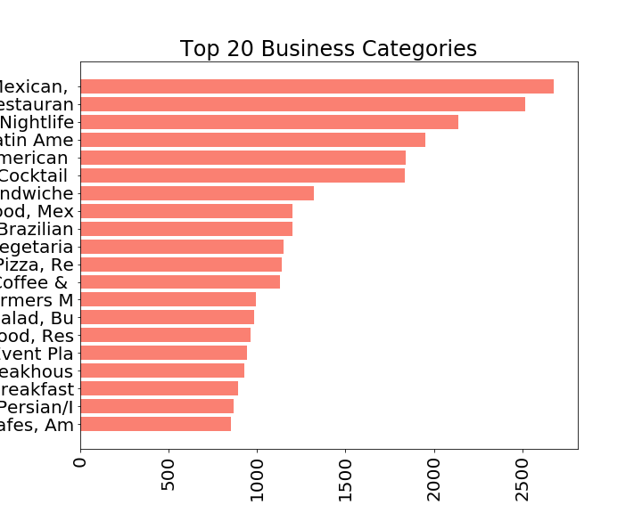

# Yelp Recommender Systems for Scottsdale Arizona

### Project Status: [Active]

## Project Intro/Objective
The purpose of this project is to create recommenders to help users find establishments they like in Scottsdale Arizona. There are two types of recommenders employed to service this goal: collaborative filtering and content based recommenders. The collaborative filters separates pivots users and business on average user ratings. The content based recommender uses review text and categories of businesses on their vectorized cosine similarities.

### Methods Used
* Inferential Statistics
* Machine Learning
* Data Visualization
* Predictive Modeling
* Model Validation

### Technologies
* Python and Libraries (pandas, numpy, sklearn, tensorflow, keras, surprise, wordcloud, matplotlib)
* Docker (for Tensorflow GPU)
* flask (api, not operational yet)
* Postman (api, not operational yet)

## Project Description
The project is based on the open yelp dataset found [here](yelp.com/dataset). The recommenders will mainly come from three sources: user.json, review.json, and business.json (see how to run the project to get those files below), which will be merged to create a master table with an inner join based on the feature business_id.

From the master table, the city will be narrowed to Scottsdale to perform EDA, pivot table on user_id and business_id, SVD, NMF, Neuro Network modeling and content based filtering. The result is four recommender models: 3 collaborative and 1 content based.

### EDA
The business environment in Scottsdale Arizona is mainly service oriented. There are *7081* unique Scottsdale businesses in the data set and the top 20 categories are shown below:

| Scottsdale, AZ | |
| :-----: | :-----: |
|  | |

In addition to the top categories, it is important to see how the businesses are *rated* along with their *review counts* to get review sentiment:

| Business Ratings Scottsdale, AZ | Business Review Count |
| :-----: | :-----: |
|  |  |

Users then generate *ratings* for the business establishments, here are their *stars given* on the scale of 1 to 5:

| Users in Scottsdale, AZ | |
| :-----: | :-----: |
|  | |

In addition to user ratings, it is good to get a sense of

(Provide more detailed overview of the project.  Talk a bit about your data sources and what questions and hypothesis you are exploring. What specific data analysis/visualization and modeling work are you using to solve the problem? What blockers and challenges are you facing?  Feel free to number or bullet point things here)

# Folders on the Github repo
* data - *folder missing* because of file size restrictions by Github
* flask - folder where the web api is housed (not operational)
* NN_Embeded_Model - folder where the Nero Network Model is stored
* photos - *folder missing* because of file size restrictions by Github
* png - where EDA photos are stored
* src - folder where the code for the jupyter notebook is housed

## To Run This Project for Yourself
1. Clone this [repo](https://github.com/yuchild/yelp_cap3_jupyter.git).
2. Create a folder within the repo named *data* and download dataset from yelp [here](https://www.yelp.com/dataset/download).
    *This is because Github does not accept files larger than 2.3GB*
    *Yelp will ask for your information prior to download*
3. Unzip the yelp_dataset.tar inside the data folder you created
4. Delete the yelp_dataset.tar file, as its file size is 3.9GB
5. Make sure your workstation has 64GB of ram, or use AWS services with enough 64GB+ ram capacity.

## Contact
* You can find me on, [you can do that here](gstudents.slack.com).
