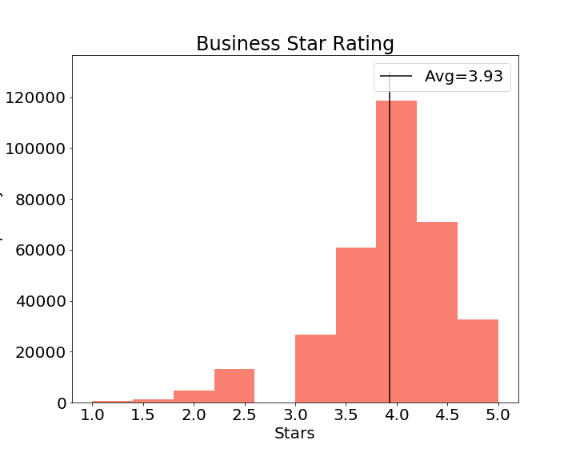
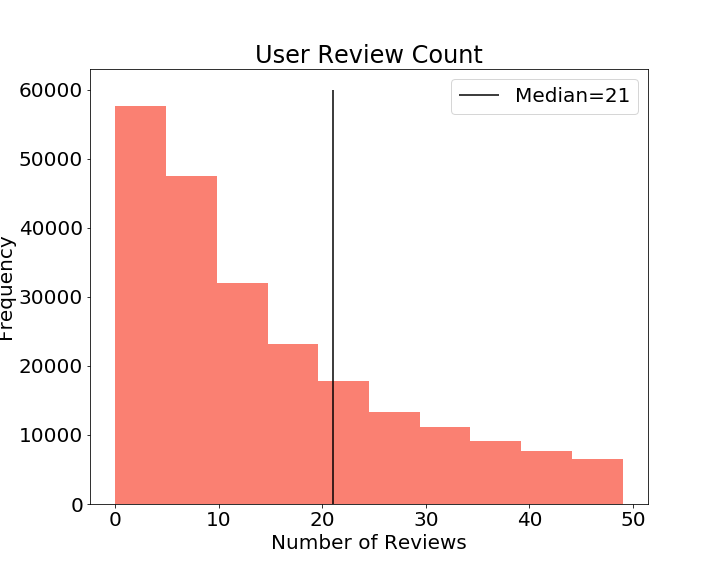

# Yelp Recommender Systems for Scottsdale Arizona

### Project Status: [Active]

## Project Intro/Objective
The purpose of this project is to create recommenders to help users find establishments they like in Scottsdale Arizona. There are two types of recommenders employed to service this goal: collaborative filtering and content based recommenders. The collaborative filters separates pivots users and business on average user ratings. The content based recommender uses review text and categories of businesses on their vectorized cosine similarities.

### Methods Used
* Inferential Statistics
* Machine Learning
* Data Visualization
* Predictive Modeling
* Model Validation

### Technologies
* Python and Libraries (pandas, numpy, sklearn, tensorflow, keras, surprise, wordcloud, matplotlib)
* Docker (for Tensorflow GPU)
* flask (api, not operational yet)
* Postman (api, not operational yet)

## Project Description and Exploratory Data Analysis (EDA)
The project is based on the open yelp dataset found [here](yelp.com/dataset). The recommenders will mainly come from three sources: user.json, review.json, and business.json (see how to run the project to get those files below), which will be merged to create a master table with an inner join based on the feature business_id.

From the master table, the city will be narrowed to Scottsdale to perform EDA, pivot table on user_id and business_id, SVD, NMF, Neuro Network modeling and content based filtering. The result is four recommender models: 3 collaborative and 1 content based.

### EDA
The business environment in Scottsdale Arizona is mainly service oriented. There are **7081** unique Scottsdale businesses in the dataset and the top 20 categories are shown below:

| Scottsdale, AZ |
| :-----: |
|  |
 

In addition to the top categories, it is important to see how the businesses are **rated** (scale of 1 to 5) along with their **review counts** to get review sentiment:

| Business Ratings in Scottsdale, AZ | Business Review Count in Scottsdale, AZ|
| :-----: | :-----: |
|  |  |
 

Users then generate **ratings** for the business establishments, here are their **stars given** on the scale of 1 to 5:

| Users in Scottsdale, AZ |
| :-----: |
|  |
 

In addition to user ratings (on the scale of 1 to 5), it is good to get a sense of user review and checkin counts, both should be **similar**:

| User Ratings Scottsdale, AZ | User Check-In Counts Scottsdale, AZ|
| :-----: | :-----: |
|  |  |
 

Lets take a deeper dive into the reviews. Here are the **review** wordcloud and top 10 review words used:

| Reviews Wordcloud Scottsdale, AZ | Top 10 Review Words Scottsdale, AZ|
| :-----: | :-----: |
|  |  |
 

Lets take a deeper dive into the reviews. Here are he **tips** wordcloud and top 10 tip words used:

| Tips Wordcloud Scottsdale, AZ | Top 10 Tip Words Scottsdale, AZ|
| :-----: | :-----: |
|  |  |
 

## Models for Recommenders

### SVD and NMF Models
The collaborative matrix used is made up of **140940** unique user_id on the index column and **7081** unique business_id along the top column headers. The values inside are comprised of the average of user ratings. The average user rating is chosen to exploit user insights along the types of businesses they have patronized. Below is a sample of one user's recommendation and her 10 patronized establishments:

| SVD Recommendations in Scottsdale, AZ | NMF Recommendations  in Scottsdale, AZ | Patroized Establishments in Scottsdale |
| :-----: | :-----: | :-----: |
|  |  |  |
 

### SVD and NMF Model Validations
Using the python library Surprise, the folling metrics for 7 fold cross validations are achieved:

| 7 CV Validations with Surprise |
| :-----: |
|   |
 

### Embedded Neuro Network Model
This 10 factor embedded (for both user_id and business_id) network was not as robust as the SVD and NMF models. See **MSE Loss** and **Accuracy** below:

| Embedded Neuro Network Loss and Accuracy |
| :-----: |
|   |
 

| Sample output of Neuro Network Model |
| :-----: |
|   |
 

### Content Filtering for Recommending Businesses
Taking a sample business Janet Kirkman Bridal Redesigns, cosine similarity matrix was able to recommend the following:

| Sample output for Neuro Network Model |
| :-----: |
|   |
|   |
 

## Future Directions
This project surveyed three unsupervised learning and one consine similarity learning. There are two main points of improvement:
1. Devising a metric to produce ROC and Precision Recall Curves
2. Further investigations into top 5 instead of top 1 errors from the validation separates
3. A web API was in development with flask but failed to launch from technical challenges
4. Tuning the neuro network model with possible addition of data from web scrapping
5. Provide justification that these recommenders are better than the yelp sorting options
 
 

## Folders on the Github Repository
* data - **folder missing** because of file size restrictions by Github
* flask - folder where the web api is housed (not operational)
* NN_Embeded_Model - folder where the Nero Network Model is stored
* photos - **folder missing** because of file size restrictions by Github
* png - where EDA photos are stored
* src - folder where the code for the jupyter notebook is housed
 

## To Run This Project for Yourself
1. Clone this [repo](https://github.com/yuchild/yelp_cap3_jupyter.git).
2. Create a folder within the repo named **data** and download dataset from yelp [here](https://www.yelp.com/dataset/download).
    **This is because Github does not accept files larger than 2.3GB**
    **Yelp will ask for your information prior to download**
3. Unzip the yelp_dataset.tar inside the data folder you created
4. Delete the yelp_dataset.tar file, as its file size is 3.9GB
5. Make sure your workstation has 64GB of ram, or use AWS services with enough 64GB+ ram capacity.
 

## Contact
* You can find me (David Yu) on slack, [you can do that here](gstudents.slack.com).
